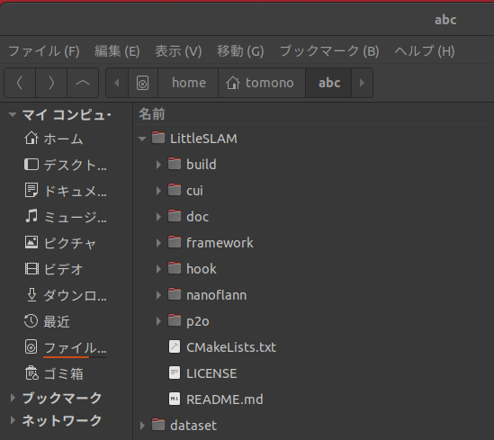
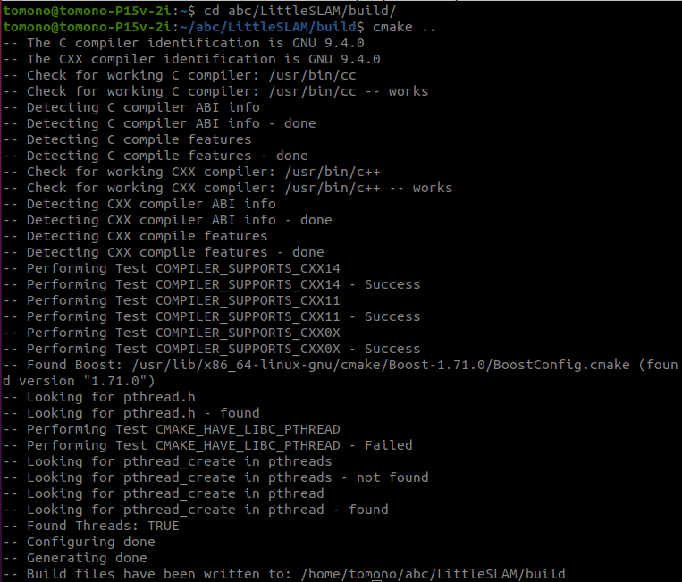
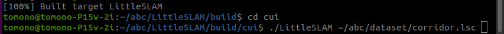
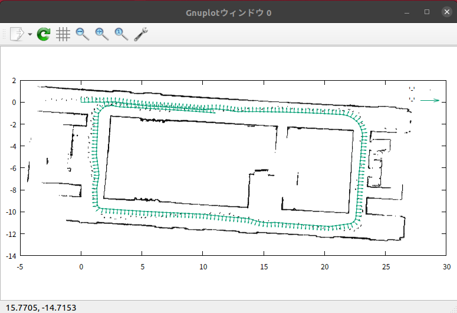

## LittleSLAMの使い方（Linuxの場合）

### (1) 関連ソフトウェアのインストール

- C++コンパイラ(gcc)、Boost、Eigen、CMake, gnuplot  
以下のコマンドで、まとめてインストールします。

</code></pre>
<pre><code> $ sudo apt install build-essential cmake libboost-all-dev libeigen3-dev gnuplot gnuplot-x11 git-all
</code></pre>

- p2o  
[p2o-v1](https://github.com/furo-org/p2o/tree/p2o_v1)のGithubサイトを開きます。
以下のどちらかの方法でp2oをダウンロードします。  
(A) Github画面の"Clone or download"ボタンを押して、"Download ZIP"を選択し、
p2o-p2o_v1.zipをダウンロードします。zipファイルの展開方法は後述します。  
(B) gitを使って、LittleSLAMのサブモジュールとしてリポジトリをcloneします（下記参照）。 

- nanoflann  
[nanoflann](https://github.com/jlblancoc/nanoflann)のGithub画面の"Clone or download"ボタンを押して、
"Download ZIP"を選択し、nanoflann-master.zipをダウンロードします。
zipファイルの展開方法は後述します。  

### (2) LittleSLAMのインストール

- LittleSLAMの展開  
[LittleSLAM](https://github.com/furo-org/LittleSLAM)のGithubサイトを開きます。
以下のどちらかの方法でLittleSLAMをダウンロードします。  
(A) Github画面の"Clone or download"ボタンを押して、"Download ZIP"を選択し、
LittleSLAM-master.zipをダウンロードします。
そして、このzipファイルを適当なディレクトリに展開します。
ここでは、たとえば、"\~/abc/LittleSLAM"に展開するとします。
"abc"はユーザが決める任意のディレクトリです。
LittleSLAM-master.zipの中の"LittleSLAM-master"ディレクトリの下の
p2o以外の4個のディレクトリと3個のファイルを"\~/abc/LittleSLAM"の下にコピーします。  
(B) gitでrecursiveオプションをつけてリポジトリをcloneします。
```
git clone --recursive https://github.com/furo-org/LittleSLAM.git
```

- p2oの展開（上記(A)の場合のみ）  
"\~/abc/LittleSLAM"ディレクトリの下に"p2o"ディレクトリを作成します。そして、
前述のp2o-p2o_v1.zipを解凍して、"p2o-p2o_v1"ディレクトリの下のファイル"p2o.h"を"\~/abc/LittleSLAM/p2o"ディレクトリの下にコピーします。 

- nanoflannの展開（上記(A)(B)両方）  
"\~/abc/LittleSLAM"ディレクトリの下に"nanoflann"ディレクトリを作成します。そして、
前述のnanoflann-master.zipを解凍して、"nanoflann-master/include"ディレクトリの下の
ファイル"nanoflann.h"を"\~/abc/LittleSLAM/nanoflann"ディレクトリの下にコピーします。 


- buildディレクトリの作成  
"\~/abc/LittleSLAM"の下にbuildディレクトリを作成します。  
ここまでのディレクトリ構成は以下のようになります。



- CMakeの実行  
コンソールで、buildディレクトリに移動し、cmakeを実行します。

</code></pre>
<pre><code> ~/abc/LittleSLAM$ cd build
</code></pre>
<pre><code> ~/abc/LittleSLAM/build$ cmake ..
</code></pre>

下図にcmakeの実行例を示します。



あるいは、CMakeのGUI版をインストールして、GUIでCMakeを実行することもできます。

- ビルド  
コンソールで、buildディレクトリにおいてmakeを実行します。  
</code></pre>
<pre><code> ~/abc/LittleSLAM/build$ make
</code></pre>
ビルドが成功すると、"\~/abc/LittleSLAM/build/cui"ディレクトリに、実行ファイルLittleSLAMが生成されます。  


### (3) 実行

以下のコマンドで、LittleSLAMを実行します。

</code></pre>
<pre><code> ./LittleSLAM [-so] データファイル名 [開始スキャン番号]
</code></pre>

-sオプションを指定すると、スキャンを1個ずつ描画します。各スキャン形状を確認したい場合に
使います。  
-oオプションを指定すると、スキャンをオドメトリデータで並べた地図
（SLAMによる地図ではない）を生成します。  
オプション指定がなければ、SLAMを実行します。  
開始スキャン番号を指定すると、その番号までスキャンを読み飛ばしてから実行します。

例として、以下のコマンドでSLAMを実行します。  
この例では"\~/abc/LittleSLAM/dataset"ディレクトリに"corridor.lsc"というデータファイルが置かれています。  
</code></pre>
<pre><code> ~/abc/LittleSLAM/build/cui$ ./LittleSLAM ~/abc/dataset/corridor.lsc
</code></pre>

  
  
コマンドを実行すると、LittleSLAMはファイルからデータを読み込んで地図を少しずつ
構築していきます。その様子がgnuplotに描画されます。  
最終的に、下図のような地図が生成されます。  
処理が終わっても、プログラムは終了せず、地図はそのまま表示されています。  
プログラムを終了するにはCtrl-Cを押してください。

　

